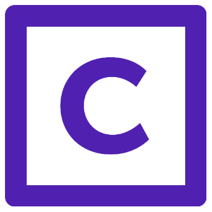
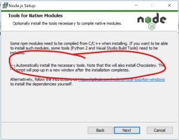

## centare.com

### How to create and publish a blog
---
## Built with Gatsby

---
## Development Environment Setup
### Prerequisites
- Node.js  - version 12.x * w/ additional tooling
- Yarn
- Git
---
## Demo - Development Environment Setup
---
## Additional Tools Option

### Only for those on Windows w/o Visual Studio
---
## Demo - Adding a Blog Post
---
## Markdown
_"Markdown is a lightweight markup language with plain-text-formatting syntax."_

### Same as the old site
---
## Frontmatter
This data is used as metadata for the Gatsby build process.

    status: "published"
    title: "My Blog Post"
    author: "John Doe"
    description: "I wrote a blog post. This is a brief description of it."
    image: "unique-image.png"
    date: "2019-08-6"

---
## Resources
@snap[text-left]
https://dev.azure.com/centare/Orbit/_wiki/wikis/Orbit.wiki/17/Centare-Website

https://www.markdownguide.org/

https://www.gatsbyjs.org/

https://centareqa.netlify.com/
@snapend
---
## Any Questions?

### Thank you!